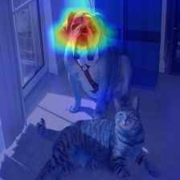
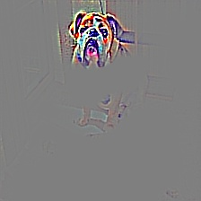

# keras-gradcam
Keras implementation of GradCAM. Comparing to its original implementation: https://github.com/eclique/keras-gradcam, the major fix is to support Tensorflow 2.0 and above by using custom gradient. 

To run script: `python grad_cam.py </path/to/img>`.

Implementation uses Tensorflow as backend and VGG16 as base model.

### Examples

### Reference

https://github.com/nguyenhoa93/GradCAM_and_GuidedGradCAM_tf2

https://medium.com/@mohamedchetoui/grad-cam-gradient-weighted-class-activation-mapping-ffd72742243a
