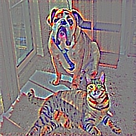

# keras-gradcam
Keras implementation of GradCAM. The major fix is to support Tensorflow 2.0 and above. 

Original Keras implementation: https://github.com/eclique/keras-gradcam

To run script: `python grad_cam.py </path/to/img>`.

### Description
Repository contains implementation of three approaches to explain base model predictions:
- [**Guided Backpropagation**](https://arxiv.org/abs/1412.6806);
- [**Grad-CAM**](https://arxiv.org/abs/1610.02391);
- **Guided Grad-CAM**, which is just multiplication of the first two.

Implementation uses Tensorflow as backend and VGG16 as base model.

### Examples

### Reference
https://github.com/nguyenhoa93/GradCAM_and_GuidedGradCAM_tf2
https://medium.com/@mohamedchetoui/grad-cam-gradient-weighted-class-activation-mapping-ffd72742243a
